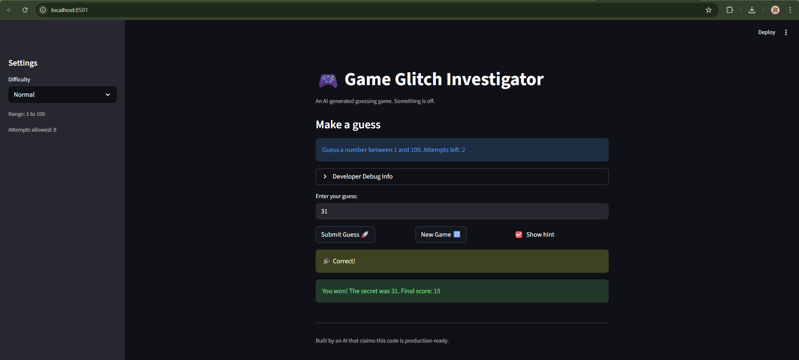

# 🎮 Game Glitch Investigator: The Impossible Guesser

## 🚨 The Situation

You asked an AI to build a simple "Number Guessing Game" using Streamlit.
It wrote the code, ran away, and now the game is unplayable. 

- You can't win.
- The hints lie to you.
- The secret number seems to have commitment issues.

## 🛠️ Setup

1. Install dependencies: `pip install -r requirements.txt`
2. Run the broken app: `python -m streamlit run app.py`

## 🕵️‍♂️ Your Mission

1. **Play the game.** Open the "Developer Debug Info" tab in the app to see the secret number. Try to win.
2. **Find the State Bug.** Why does the secret number change every time you click "Submit"? Ask ChatGPT: *"How do I keep a variable from resetting in Streamlit when I click a button?"*
3. **Fix the Logic.** The hints ("Higher/Lower") are wrong. Fix them.
4. **Refactor & Test.** - Move the logic into `logic_utils.py`.
   - Run `pytest` in your terminal.
   - Keep fixing until all tests pass!

## 📝 Document Your Experience

- [ ] Describe the game's purpose.
its a number guessing game. It has difficulty levels to set the attempt and number range limits. Once a game (or round) starts, a number is randomly generated ans the player has to guess the number using hints. The player is told to go higher or lower based on how close they are to the original number. 
- [ ] Detail which bugs you found.
The first bug I found was with the hints. The messages were swapped, so the game would tell you to go higher if your number was higher and vice versa. The secong bug was with the attempts count. Invalid guesses would count to your attempt even though you didn't make a meaningful guess.
- [ ] Explain what fixes you applied.
For the first bug, I switched the messages to correspond with how close guess was to secret. For the second bug, I moved the attempts counter into the else block, so it could only run for valid guesses.

## 📸 Demo

- [ ] [Insert a screenshot of your fixed, winning game here]

## 🚀 Stretch Features

- [ ] [If you choose to complete Challenge 4, insert a screenshot of your Enhanced Game UI here]
